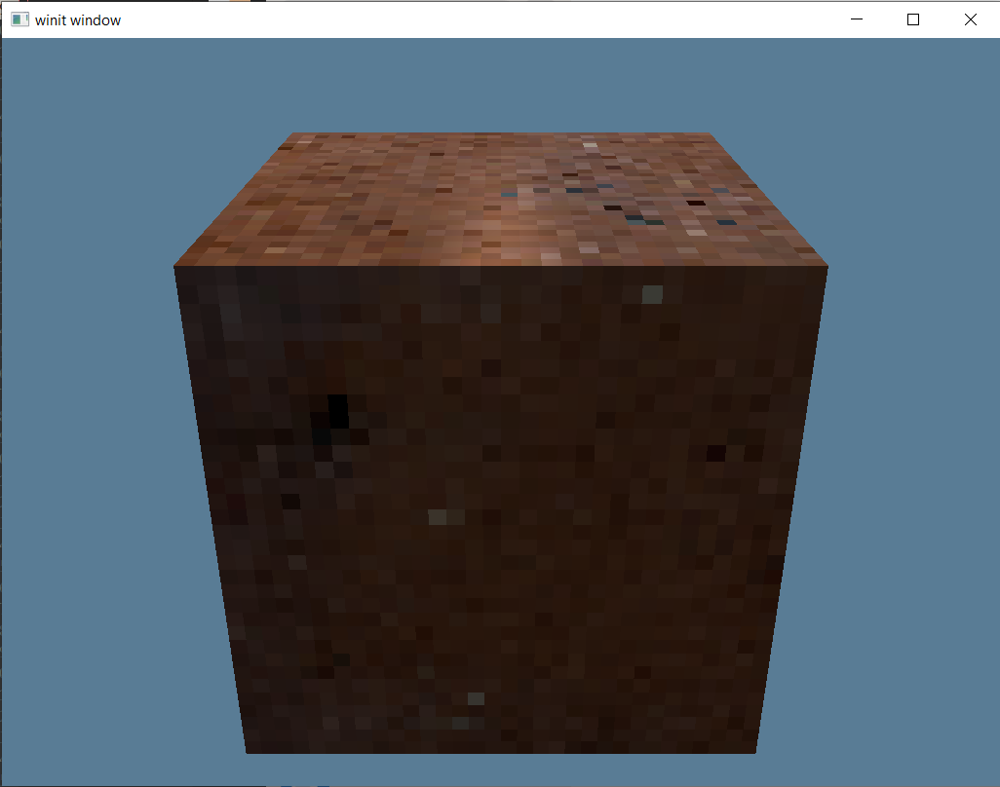

# Report
## Tested Environment
- OS: Windows 10 Pro 20H2
- Rust toolchain:
  - `rustup 1.23.1 (3df2264a9 2020-11-30)`
  - `cargo 1.50.0-nightly (a3c2627fb 2020-12-14)`
  - `rustc 1.50.0-nightly (11c94a197 2020-12-21)`
  
## External Packages
The following is a list of packages we used in the project:
- `winit` for window creation
- `wgpu` for the graphics API
- `glam` for all the linear algebra calculation
- `image` for loading images from local file system
- `anyhow` for error handling
- `async-std` for async support
- `bytemuck` for flatting struct arrays into byte arrays
- `tobj` for loading obj files
- `shaderc` for shader compilation

## Setup
The project uses [shaderc](https://github.com/google/shaderc) as an external tool to compile `glsl` shader into `SPIR-V`. To successfully build the project, users are required to have `shaderc` binary files, and set the environment variable `SHADERC_LIB_DIR` to the `lib` directory in the `shaderc` binary package directory. After that, users could esaily execute `cargo run --release` to run the project.

## Introduction
This project uses `wgpu` as the graphics API. `wgpu` is a Rust implementation of the `WebGPU` standard. One advantage of `wgpu` is that it leverages all kinds of native graphics API as its backend. For example, `DirectX 12` on Windows, `Metal` on macOS, and `Vulkan` on Linux.

## Current Progress
The project has implemented the following features:
- Texture mapping
- Perspective camera
- Mesh loading(`obj` file)
- Blinn-Phong shading

Here is a screenshot of what we've achieved so far: 

## Details
Implementing a hardware rendering pipeline is quite different from implementing a software one, and since `WebGPU` is a mordern graphics API standard, the API provides many features that aren't supported in `OpenGL`. Here I'll briefly explain how I assembled the whole pipeline.

Firstly, we need to create a `Surface`. A `Surface` represents a platform-specific window. This is where our rendered images will be presented. Then we need to create a `Adapter`. An `Adapter` is a physical representation of a GPU. With the `Adapter`, we could create a `Device` and a `Queue`. A `Device` is a logical representation of the GPU, and a `Queue` is where we submit our draw calls. Then we could create a `Swapchain`. A `Swapchain` represents a series of images which will be presented to a `Surface`.

Then we need to load compiled shaders into the memory. After that, we could load the `obj` file which we are going to render into memory, with its corresponding textures. Currently we only load the diffuse map. We need to create a `VertexBuffer` for all the vertices and an `IndexBuffer` for all the indices, and create `BindGroup`s for them.

After loading the texture, we need to submit it to GPU memory, and generate a `TextureView` and `Sampler` of that GPU texture. `TextureView` let us to have access to the texture in the GPU memory on CPU, and `Sampler` defines how we are going to sample the texture. Then we need to create a bind group for the texture, so that we could have access to the `TextureView` and `Sampler` through shader.

Now we could setup the uniform buffer, which stores transformation matrices. Firstly, we need to create a camera and calculate its corresponding view matrix and projection matrix. Since we are not moving objects in the scene, so we are not using model matrix at the moment. Similarly, we need to create a `BindGroupLayout` and a `BindGroup` to define how its going to be accessed from shader.

After that, we need to create another uniform buffer which stores all the lighting information.

We also need a depth texture for z testing. Finally, we could assemble all the stuffs into a `RenderPipeline`.

When rendering, we firstly construct an `CommandEncoder`, which is used to wrap draw calls. After that, we create a `RenderPass` from the encoder. We set the pipeline for the render pass, set all the buffers and textures and then submit the encoder.

## Future Improvements
Currently we could only render the first object in the `obj` file. We are going to provide full scene rendering support in the future. What's more, we would also like to support camera movement so that users could view objects from different angle. It would also be good if we could integrate some imgui packages into the project, so that users could easily adjust light parameters in real-time.
